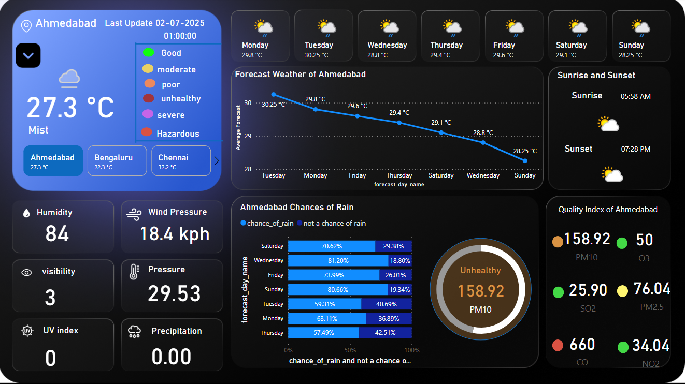
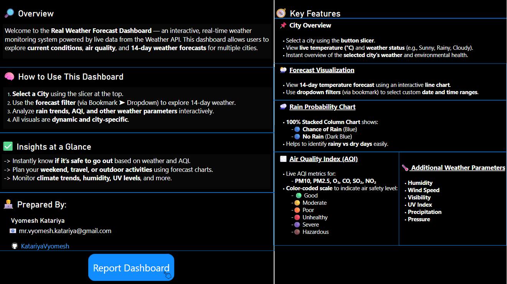

# 🌤️ Real-Time Weather Forecast Dashboard using Weather API

## 📌 Project Description

The **Real-Time Weather Forecast Dashboard** is a fully interactive Power BI report powered by a live **Weather API**, offering a deep dive into **current weather conditions**, **14-day forecasts**, and **air quality indexes** for selected cities across India.

Built for clarity and engagement, this dashboard allows users to monitor real-time environmental metrics, assess air pollution levels, and plan activities based on weather and precipitation insights — all dynamically controlled through slicers, dropdowns, and bookmarks.

---

## 🧠 Key Features

### 📍 Dynamic City Selection
- Button slicers for cities like **Ahmedabad**, **Chennai**, etc.
- Shows **current temperature (°C)** and **weather status** (e.g., Sunny, Cloudy).

### ⏳ 14-Day Forecast
- Interactive **line chart** to view temperature trends.
- **Dropdown filters** for custom date and time selection using **Power BI bookmarks**.

### 🌧️ Rain Probability Chart
- **100% Stacked Column Chart**:
  - 🔵 **Rain Expected**
  - 🔵 **No Rain**
- Visualizes chance of rain per day in an engaging format.

### 🌫️ Air Quality Index (AQI)
Monitors real-time levels of:
- **PM10**, **PM2.5**, **O₃**, **CO**, **SO₂**, **NO₂**

With color-coded air quality levels:
| Status        | Color       |
|---------------|-------------|
| Good          | 🟢 Green     |
| Moderate      | 🟡 Yellow    |
| Poor          | 🟠 Orange    |
| Unhealthy     | 🔴 Red       |
| Severe        | 🟣 Violet     |
| Hazardous     | 🟤 Maroon     |

### 🌡️ Additional Weather Insights
- 💧 **Humidity**
- 💨 **Wind Speed**
- 👁️ **Visibility**
- 🌞 **UV Index**
- 🌧️ **Precipitation**
- 🧭 **Pressure**

---

## 📂 Tech Stack

- **Power BI**: Data visualization and report building
- **Weather API**: Real-time weather and AQI data fetching
- **DAX**: Dynamic calculations
- **Power Query (M)**: Data cleaning and transformation
- **Bookmarks & Buttons**: Navigation and filtering UX

---

## 🖼️ Dashboard Preview

> _Add screenshots or GIFs here showing the visuals like button slicers, AQI bar, rain chart, and forecast line chart._

---

## 💡 Use Cases

- Plan trips and outdoor activities based on forecast and AQI.
- Monitor air quality for health and safety awareness.
- Daily weather monitoring and visualization.
- Educational tool for data analysis learners.

---

## 🚀 Getting Started

1. Connect to a free or paid **Weather API** (e.g., [WeatherAPI.com](https://www.weatherapi.com/))
2. Load the API data into Power BI using Web connector
3. Transform JSON/XML to tabular form using **Power Query**
4. Build relationships, create measures (DAX), and visuals
5. Deploy slicers, bookmarks, and interactive filters
6. Customize colors based on AQI scale using conditional formatting

---

---
## 👨‍💻 Author

**Vyomesh Katariya**  
📍 Ahmedabad, Gujarat, India  
📧 mr.vyomesh.katariya@gmail.com  
🌐 [Portfolio Website](https://katariyavyomesh.github.io/vyomesh-portfolio)  

---

## 🔗 Project Repository

👉 [GitHub Link](https://github.com/katariyavyomesh/real-weather-dashboard)

> *(Update with actual repo link if different)*

---

## 🙏 Acknowledgements

- [WeatherAPI.com](https://www.weatherapi.com/)
- Power BI Community
- Icons from Emoji/Unicode/Flaticon (if used)
- Color palette and AQI reference from CPCB India

---

## 📢 License

This project is licensed under the **MIT License**. You are free to use, share, and adapt with attribution.

---

